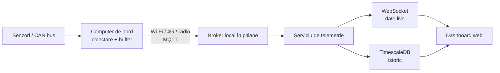

# Recomandări de arhitectură pentru dashboardul mașinii solare

## Obiectiv

Construirea unei aplicații web pentru pitlane care primește telemetrie de la mașina solară, afișează datele în timp real și păstrează istoricul fiecărei sesiuni.

Sistemul ar trebui proiectat **local-first**: funcțiile principale trebuie să continue să opereze în rețeaua locală din pitlane chiar dacă internetul sau legătura cu mașina cade temporar.

## Arhitectură recomandată



### Tehnologii recomandate

- **Frontend:** React, TypeScript și Vite.
- **Grafice:** Apache ECharts sau uPlot pentru fluxuri rapide de date.
- **Backend:** FastAPI și Python, în special dacă vor fi adăugate estimări, predicții sau analiză de date.
- **Mașină → server:** MQTT 5 cu QoS 1.
- **Server → browser:** WebSocket.
- **Bază de date:** PostgreSQL cu extensia TimescaleDB.
- **Broker MQTT:** Mosquitto pentru început; EMQX dacă sistemul crește semnificativ.
- **Instalare locală:** Docker Compose pe un laptop sau mini-PC din pitlane.
- **Cloud:** doar pentru sincronizare, backup și acces ulterior; operarea live nu trebuie să depindă de cloud.

MQTT este potrivit pentru telemetrie și oferă QoS, sesiuni și mesaje retained. WebSocket este potrivit pentru transmiterea actualizărilor din server către browser, dar trebuie considerat soft real-time, nu hard real-time. TimescaleDB optimizează inserarea și interogarea seriilor temporale prin partiționarea automată a datelor.

## Informații recomandate în dashboard

Ecranul principal trebuie să-i permită unui inginer să evalueze starea mașinii în câteva secunde:

- viteza, poziția GPS și numărul turului;
- tensiunea, curentul, puterea și SOC-ul bateriei;
- temperatura minimă, maximă și diferența de temperatură dintre celule;
- celulele cu tensiunea minimă și maximă;
- puterea produsă de panourile solare și de fiecare MPPT;
- puterea, temperatura și turația motorului/invertorului;
- consumul de energie pe tur;
- energia regenerată și energia solară acumulată;
- autonomia și energia estimate la finalul cursei;
- starea comunicației și timpul trecut de la ultimul mesaj;
- alarme prioritizate: critic, avertizare și informație.

### Organizarea interfeței

Interfața principală ar trebui împărțită în patru zone:

1. stare generală;
2. energie și baterie;
3. temperaturi și alarme;
4. hartă și poziția pe traseu.

Graficele detaliate, comparațiile și analiza istorică ar trebui să fie pe pagini separate pentru a nu aglomera ecranul principal.

## Decizii tehnice importante

1. Computerul mașinii trebuie să păstreze local datele când legătura cade și să le retransmită după reconectare.
2. Fiecare mesaj trebuie să conțină cel puțin `vehicle_id`, `session_id`, timestamp-ul mașinii, un număr secvențial și versiunea schemei de date.
3. Interfața trebuie să diferențieze clar valoarea `0` de starea „nu mai primesc date”.
4. Semnalele rapide pot fi colectate la 50–100 Hz, însă browserul poate fi actualizat la 5–20 Hz. Nu este necesară redesenarea interfeței pentru fiecare cadru CAN.
5. Alarmele trebuie calculate pe server, nu doar în browser, și trebuie înregistrate în istoricul sesiunii.
6. Sincronizarea ceasurilor este critică. Ideal, mașina folosește timestamp GNSS, iar serverul folosește NTP.
7. Comenzile către mașină trebuie separate de telemetrie. Funcțiile critice nu trebuie controlate direct din dashboard fără autentificare, confirmare, jurnalizare și mecanisme dedicate de siguranță.
8. Pentru fiecare semnal ar trebui transmisă și starea calității: valid, stale, indisponibil sau eroare senzor.
9. Backendul trebuie să monitorizeze mesajele lipsă, duplicate sau primite în ordine incorectă.

## Structura recomandată a unui mesaj

```json
{
  "schema_version": 1,
  "vehicle_id": "solar-car-01",
  "session_id": "race-2026-07-21",
  "timestamp": "2026-07-21T12:34:56.123Z",
  "sequence": 18452,
  "signals": {
    "battery_voltage_v": 112.6,
    "battery_current_a": 18.4,
    "battery_soc_pct": 76.2,
    "vehicle_speed_kph": 63.8
  }
}
```

Pentru legături cu lățime de bandă redusă, mesajele dintre mașină și broker pot fi codificate binar cu MessagePack sau Protocol Buffers. Serverul poate furniza browserului JSON, care este mai ușor de depanat și utilizat în frontend.

## Prima versiune recomandată (MVP)

Prima versiune ar trebui să includă:

- simulator de telemetrie pentru dezvoltare fără mașină;
- broker MQTT;
- backend care validează, salvează și retransmite datele;
- dashboard live;
- alarme pentru baterie, temperaturi și pierderea comunicației;
- pornirea și oprirea înregistrării unei sesiuni;
- replay la viteze 1×, 2× și 10×;
- export în format CSV;
- autentificare simplă și roluri `operator` și `viewer`;
- indicator vizibil pentru starea conexiunii și vechimea ultimei valori.

Pentru MVP este recomandat un monolit modular orchestrat cu Docker Compose. Kubernetes, Kafka și un număr mare de microservicii ar adăuga complexitate fără beneficii suficiente pentru una sau câteva mașini.

## Etape de dezvoltare

### Etapa 1 — clarificarea datelor

- inventarierea senzorilor și semnalelor;
- obținerea fișierelor DBC;
- stabilirea frecvenței fiecărui semnal;
- definirea pragurilor de alarmă;
- definirea latenței acceptabile.

### Etapa 2 — infrastructura de telemetrie

- simulator de date;
- broker MQTT;
- serviciu de ingestie;
- validare și buffer pentru reconectare;
- stocare TimescaleDB.

### Etapa 3 — dashboardul live

- stare generală;
- valori și grafice live;
- hartă;
- alarme;
- stare conexiune.

### Etapa 4 — analiză și operare

- sesiuni și replay;
- comparații între tururi;
- export CSV;
- predicție de energie și autonomie;
- sincronizare opțională cu cloudul.

## Întrebări de clarificare

1. Ce interfață există pe mașină: CAN, CAN-FD, serial, Ethernet sau altceva?
2. Ce dispozitiv colectează datele: Raspberry Pi, Jetson, microcontroler sau laptop?
3. Aproximativ câte semnale există și la ce frecvență sunt transmise?
4. Prin ce legătură ajung datele în pitlane: Wi-Fi, 4G/5G, LoRa sau radio propriu?
5. Dashboardul va monitoriza o singură mașină sau mai multe?
6. Există deja fișiere DBC și o listă a semnalelor?
7. Este necesară doar monitorizarea sau și transmiterea de comenzi către mașină?
8. Ce latență este acceptabilă: sub 100 ms, sub 500 ms sau aproximativ o secundă?
9. Sistemul trebuie să funcționeze complet fără internet?
10. Ce tehnologii cunoaște deja echipa: Python, JavaScript/TypeScript, C++?

## Referințe

- [Specificația MQTT](https://mqtt.org/mqtt-specification/)
- [FastAPI WebSockets](https://fastapi.tiangolo.com/advanced/websockets/)
- [TimescaleDB hypertables](https://docs.timescale.com/use-timescale/latest/hypertables/)
- [Grafana Live și WebSocket](https://grafana.com/docs/grafana/latest/setup-grafana-live/)
